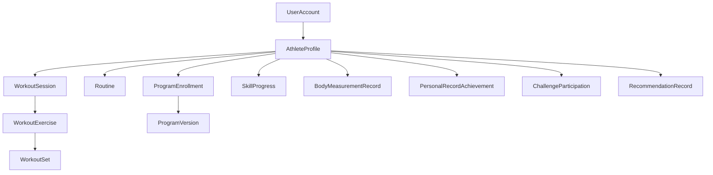
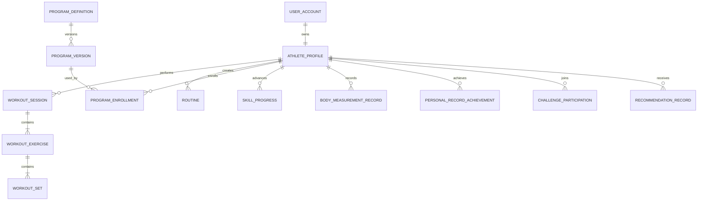

# Domain Model

## Deep Architectural Analysis

### Domain Core

Atlas is a long-horizon training intelligence platform, not a workout log. The core business problem is helping a person improve capability and consistency over years while minimizing injury risk and motivation collapse.

### Strategic Tension

- Short-term app behavior optimizes for session completion.
- Long-term product value optimizes for safe progression quality.

The model must preserve both by separating operational state from immutable historical facts.

### Long-Term Constraints

- AI capabilities will evolve faster than product UX.
- Historical data quality determines future AI ceiling.
- Regulatory/privacy expectations will tighten over time.
- Multi-device and intermittent connectivity are normal, not edge cases.

### Critical Domain Assumptions

- Progress is individualized, not leaderboard-defined.
- Recommendation systems must be explainable and conservative under uncertainty.
- Evidence quality is more important than feature breadth.

### Architectural Implication

Use a hybrid model:

- Transactional aggregates for current behavior and invariants.
- Durable event ledger for historical truth and AI/analytics replay.
- Derived read models for product speed.

## Domain Decomposition

### Core Domain

- Training Execution
- Progression Intelligence
- Skill Development

### Supporting Subdomains

- Identity and Consent
- Program Authoring and Delivery
- Recovery and Readiness
- Community and Challenges
- Notifications and Engagement

### Generic Subdomains

- Search
- Auditing
- Reporting
- Billing (future)

## Bounded Contexts

### Identity Context

Owns user identity, consent, privacy settings, account lifecycle.

### Athlete Context

Owns profile, goals, preferences, equipment, limitations, training baseline.

### Training Context

Owns workout sessions, exercise performance, routines, program enrollment.

### Skill Context

Owns skill definitions, stage rules, unlock evidence, milestone assignments.

### Progress Context

Owns PR logic, streaks, trend computation, progression snapshots.

### Recovery Context

Owns readiness signals, fatigue estimates, deload recommendations (future).

### Community Context

Owns posts, comments, challenge participation, moderation facts.

### Recommendation Context

Owns recommendation generation records, feedback loop, confidence and rationale.

### Analytics Context

Owns denormalized facts and aggregates for BI and model training.

## Design Principles

1. Facts first: store irreversible facts as events.
2. State second: current state is a projection and can be rebuilt.
3. Immutable performance evidence: completed workout facts are append-only.
4. Explainable AI by design: every recommendation stores rationale and confidence.
5. Version everything that affects interpretation: programs, skill rules, scoring policies.
6. Privacy by architecture: separate identifying data from behavioral data where practical.
7. Quality over volume: collect rich structured data, reject low-value noise.

## Tradeoff Discussion

### Decision 1: Event-Rich CRUD Hybrid (not full event sourcing)

- Why this design:
	- Full event sourcing across all contexts increases implementation complexity for MVP.
	- Hybrid gives auditability where it matters (training/progress/recommendations) while keeping delivery speed.
- Alternatives considered:
	- Pure CRUD: simpler but weak historical replay and AI training lineage.
	- Full event sourcing everywhere: strongest history but high operational burden.
- Strengths:
	- Balanced complexity, strong historical traceability for critical flows.
- Weaknesses:
	- Dual-write risk between state and event streams if poorly implemented.
- Future impact:
	- Can incrementally move selected contexts to full event sourcing.

### Decision 2: OLTP and Analytics Separation

- Why this design:
	- Product workloads and analytical workloads have different latency and shape.
- Alternatives considered:
	- Single datastore for all workloads.
- Strengths:
	- Protects user transaction latency.
- Weaknesses:
	- Requires reliable data pipeline and reconciliation checks.
- Future impact:
	- Enables billion-record growth and offline model training.

### Decision 3: Normalized Core + Denormalized Read Models

- Why this design:
	- Core invariants need consistency, UI needs speed.
- Alternatives considered:
	- Fully normalized reads (slow UX), fully denormalized core (hard invariants).
- Strengths:
	- Predictable write integrity plus responsive queries.
- Weaknesses:
	- Projection lag must be monitored.
- Future impact:
	- Scales across mobile and AI interfaces.

### Decision 4: Append-Only Performance Ledger

- Why this design:
	- Historical performance evidence is strategic and should not be overwritten.
- Alternatives considered:
	- Mutable workout logs.
- Strengths:
	- Reliable PR and progression analytics, defensible AI explanations.
- Weaknesses:
	- Correction flows require compensating events, not direct edits.
- Future impact:
	- Supports retrospective model improvements and governance.

### Decision 5: Recommendation Evidence and Feedback as First-Class Data

- Why this design:
	- AI quality depends on knowing what was recommended, why, and user response.
- Alternatives considered:
	- Logging only accepted recommendations.
- Strengths:
	- Enables learning from rejects, not only accepts.
- Weaknesses:
	- Additional storage and privacy sensitivity.
- Future impact:
	- Essential for adaptive coaching quality and safety tuning.

## Production-Ready Domain Model

### Aggregates and Ownership

- UserAccount (Identity)
	- Owns login state, consent state, account status.
- AthleteProfile (Athlete)
	- Owns goals, preferences, equipment, limitations.
- WorkoutSession (Training)
	- Owns performed exercises and sets in one session boundary.
- Routine (Training)
	- Owns reusable planned exercise sequence.
- ProgramEnrollment (Training)
	- Owns user-specific program progression state.
- SkillProgress (Skill)
	- Owns user stage within a skill progression.
- ChallengeParticipation (Community)
	- Owns challenge progress evidence for one user.
- RecommendationRecord (Recommendation)
	- Owns issued recommendation and response lifecycle.

### Value Objects

- Duration
- RepetitionCount
- ExternalLoad
- EffortScore (RPE/RIR)
- DateRange
- MovementQualityIndicator
- ConfidenceScore
- FatigueIndicator

All value objects are immutable.

### Key Invariants

- Completed workout session must contain at least one completed set.
- WorkoutSet cannot exist without parent WorkoutExercise in same WorkoutSession.
- ProgramEnrollment references one specific ProgramVersion.
- Skill stage can only move forward unless explicit regression policy event exists.
- PR achievements require verifiable underlying set evidence.
- Recommendation marked Accepted/Rejected cannot return to Pending.

### State Transitions

- WorkoutSession: Planned -> Active -> Paused -> Completed | Abandoned
- ProgramEnrollment: Enrolled -> Active -> Paused -> Completed | Dropped
- SkillProgress: StageN -> StageN+1 (forward by rule satisfaction)
- RecommendationRecord: Generated -> Viewed -> Accepted | Rejected | Ignored

### Domain Services

- PRDetectionService
- SkillUnlockService
- ProgressTrendService
- FatigueEstimationService (rule-based in v1, model-based later)
- RecommendationPolicyService
- ProgramProgressionService

### Specifications

- IsValidCompletedWorkout
- IsPRAchievement
- IsSkillUnlockQualified
- IsChallengeCompletionQualified
- IsRecommendationSafeToServe

### Policies

- ConservativeRecommendationPolicy
- HistoricalCorrectionPolicy
- DataRetentionPolicy
- PrivacyConsentPolicy
- SafetyOverridePolicy

### Read Models

- AthleteDashboardView
- ProgramProgressView
- SkillRoadmapView
- PRHistoryView
- ConsistencyCalendarView
- RecoveryTrendView
- RecommendationHistoryView
- CoachSummaryView (future)

## Entity Catalog

For each entity: mandatory fields, optional fields, AI-useful fields, analytics fields, metadata, timestamps, versioning, soft delete, audit, data quality, mutability.

### UserAccount

- Mandatory:
	- userId, emailHash, authProvider, accountStatus, createdAt
- Optional:
	- displayName
- AI-useful:
	- none directly (avoid identity leakage)
- Analytics:
	- signupChannel, activationTimestamp
- Metadata:
	- locale, timezone
- Timestamps:
	- createdAt, updatedAt, lastLoginAt
- Versioning:
	- accountVersion
- Soft delete:
	- deletedAt, deletionReason
- Audit:
	- createdBy, updatedBy, changeReason
- Data quality:
	- unique identity constraints, verified contact
- Mutability:
	- Immutable: userId, createdAt
	- Append-only: status change history via events
	- Mutable: timezone, locale

### AthleteProfile

- Mandatory:
	- userId, experienceLevel, primaryGoal, equipmentProfile
- Optional:
	- mobilityLimitations, injuryHistorySummary
- AI-useful:
	- trainingAge, preferenceSignals, limitationFlags
- Analytics:
	- goalCategory, segmentTags
- Metadata:
	- profileCompletenessScore
- Timestamps:
	- createdAt, updatedAt
- Versioning:
	- profileVersion
- Soft delete:
	- not applicable (owned by account)
- Audit:
	- changeActor, sourceDevice
- Data quality:
	- controlled vocabularies for goals and equipment
- Mutability:
	- Immutable: profile creation event
	- Append-only: preference change history
	- Mutable: current preferences snapshot

### WorkoutSession

- Mandatory:
	- workoutSessionId, userId, startedAt, status
- Optional:
	- endedAt, notes, perceivedDifficulty
- AI-useful:
	- sessionContext, completionPattern, interruptionPattern
- Analytics:
	- totalDuration, completionRate, dropoutStage
- Metadata:
	- sourceDevice, appVersion
- Timestamps:
	- startedAt, endedAt, createdAt, updatedAt
- Versioning:
	- correctionVersion
- Soft delete:
	- disallowed for completed sessions; use correction events
- Audit:
	- correctionReason, correctedBy
- Data quality:
	- enforce chronological consistency
- Mutability:
	- Immutable: completed session facts
	- Append-only: correction ledger
	- Mutable: active session transient state

### WorkoutExercise

- Mandatory:
	- workoutSessionId, exerciseId, sequenceOrder
- Optional:
	- targetScheme, exerciseNotes
- AI-useful:
	- substitutionReason, movementPatternTag
- Analytics:
	- frequency, completionFlag
- Metadata:
	- importedFromRoutine/program
- Timestamps:
	- createdAt
- Versioning:
	- none beyond parent correction version
- Soft delete:
	- by correction event only
- Audit:
	- insertionSource
- Data quality:
	- valid exercise reference, unique order per session
- Mutability:
	- Immutable after completion, correction via append

### WorkoutSet

- Mandatory:
	- workoutExerciseId, setOrder, repsOrDuration, loadValueOrBodyweightFlag
- Optional:
	- rir, rpe, restDuration, tempo, formNote
- AI-useful:
	- fatigueSignal, effortSignal, failureFlag, asymmetryFlag
- Analytics:
	- volumeContribution, intensityBand
- Metadata:
	- inputMode (manual/wearable/sensor)
- Timestamps:
	- loggedAt
- Versioning:
	- correctionVersion
- Soft delete:
	- not deleted, superseded by correction
- Audit:
	- deviceClockOffset, serverIngestTime
- Data quality:
	- bounded ranges, unit consistency
- Mutability:
	- Immutable evidence after completion

### Routine

- Mandatory:
	- routineId, userId, name, orderedExerciseList
- Optional:
	- description, tags
- AI-useful:
	- routinePreferenceProfile
- Analytics:
	- reuseCount, completionRateWhenUsed
- Metadata:
	- createdFromTemplate
- Timestamps:
	- createdAt, updatedAt
- Versioning:
	- routineVersion
- Soft delete:
	- archivedAt
- Audit:
	- updateActor
- Data quality:
	- at least one exercise, stable ordering
- Mutability:
	- Mutable current definition
	- Append-only historical versions

### ProgramDefinition and ProgramVersion

- Mandatory:
	- programId, versionId, goalType, durationWeeks, progressionRules
- Optional:
	- coachNotes, prerequisites
- AI-useful:
	- responseBySegment, dropoffByWeek
- Analytics:
	- enrollmentRate, completionRate
- Metadata:
	- publishedBy, publicationChannel
- Timestamps:
	- publishedAt, retiredAt
- Versioning:
	- explicit, immutable per version
- Soft delete:
	- retire only
- Audit:
	- approvalRecord
- Data quality:
	- valid progression graph
- Mutability:
	- ProgramVersion immutable after publish

### ProgramEnrollment

- Mandatory:
	- enrollmentId, userId, programVersionId, status
- Optional:
	- pauseReason, completionSummary
- AI-useful:
	- adherencePattern, dropoutRiskSignals
- Analytics:
	- weekProgress, completionOutcome
- Metadata:
	- enrollmentSource
- Timestamps:
	- enrolledAt, activatedAt, completedAt
- Versioning:
	- status revision
- Soft delete:
	- no hard delete
- Audit:
	- status change actor
- Data quality:
	- one active enrollment per program per user
- Mutability:
	- state mutable, transitions append-audited

### SkillDefinition and SkillProgress

- Mandatory:
	- skillId, stageRules (definition) and userId, currentStage (progress)
- Optional:
	- unlockEvidenceSummary
- AI-useful:
	- progressionVelocity, failedAttemptsTrend
- Analytics:
	- stageDistribution, medianTimeToStage
- Metadata:
	- ruleVersion
- Timestamps:
	- unlockedAt per stage
- Versioning:
	- ruleVersion, progressVersion
- Soft delete:
	- definitions retired, progress preserved
- Audit:
	- stageUnlockEvaluator
- Data quality:
	- deterministic unlock checks
- Mutability:
	- stage history append-only
	- current stage snapshot mutable by projection

### BodyMeasurementRecord

- Mandatory:
	- userId, measurementType, value, unit, measuredAt
- Optional:
	- contextTag, notes
- AI-useful:
	- trend slope, variability profile
- Analytics:
	- frequency and trend adherence
- Metadata:
	- captureMethod
- Timestamps:
	- measuredAt, ingestedAt
- Versioning:
	- correctionVersion
- Soft delete:
	- correction/supersede only
- Audit:
	- sourceDevice
- Data quality:
	- unit normalization and plausible ranges
- Mutability:
	- append-only preferred

### PersonalRecordAchievement

- Mandatory:
	- userId, exerciseId, metricType, metricValue, evidenceSetId
- Optional:
	- confidenceFlag
- AI-useful:
	- acceleration/deceleration indicators
- Analytics:
	- PR frequency and distribution
- Metadata:
	- detectionAlgorithmVersion
- Timestamps:
	- achievedAt, detectedAt
- Versioning:
	- detectionVersion
- Soft delete:
	- no delete; invalidate by compensating event if wrong
- Audit:
	- detectionTraceId
- Data quality:
	- strict evidence linkage required
- Mutability:
	- append-only

### ChallengeDefinition and ChallengeParticipation

- Mandatory:
	- challengeId, objectiveRules and participationId, userId, progressState
- Optional:
	- socialSharePreference
- AI-useful:
	- motivation response profile
- Analytics:
	- join rate, completion rate, dropout curve
- Metadata:
	- challengeTheme
- Timestamps:
	- joinedAt, completedAt
- Versioning:
	- challengeRuleVersion
- Soft delete:
	- challenge retire; participation retained
- Audit:
	- evidence verification log
- Data quality:
	- objective event-backed completion only
- Mutability:
	- participation events append-only

### RecommendationRecord

- Mandatory:
	- recommendationId, userId, recommendationType, rationale, confidence, generatedAt
- Optional:
	- servingContext, dismissedReason
- AI-useful:
	- modelFeatureSnapshot, outcomeLabel
- Analytics:
	- acceptanceRate, regretRate proxy
- Metadata:
	- modelVersion, policyVersion
- Timestamps:
	- generatedAt, viewedAt, respondedAt
- Versioning:
	- recommendationSchemaVersion
- Soft delete:
	- never hard-delete; redact payload if required
- Audit:
	- traceId, decisionPathHash
- Data quality:
	- required rationale and confidence bounds
- Mutability:
	- response appended; recommendation payload immutable

## Aggregate Diagram

## Relationship Diagram

## Event Catalog

### Identity and Profile Events

- UserRegistered
- UserConsentUpdated
- UserPreferenceChanged
- AthleteProfileUpdated

### Training Events

- WorkoutStarted
- WorkoutPaused
- WorkoutResumed
- WorkoutCompleted
- WorkoutAbandoned
- WorkoutCorrected
- ExerciseCompleted
- SetLogged
- RoutineCreated
- RoutineUpdated
- ProgramEnrolled
- ProgramPaused
- ProgramResumed
- ProgramCompleted

### Progress and Skill Events

- PersonalRecordAchieved
- SkillUnlocked
- SkillStageAdvanced
- MilestoneAwarded
- StreakUpdated
- BodyMeasurementRecorded

### Recovery and Recommendation Events

- RecoverySignalCaptured
- FatigueEstimated
- RecommendationGenerated
- RecommendationViewed
- RecommendationAccepted
- RecommendationRejected
- RecommendationIgnored

### Community Events

- CommunityPostPublished
- CommentAdded
- ChallengeJoined
- ChallengeProgressUpdated
- ChallengeCompleted

### Permanence Guidance

Permanent storage required:

- All workout/set/performance facts
- All progression and PR facts
- All recommendation generation plus user response
- All rule version changes that affect interpretation
- All consent/privacy changes

Not required for permanent storage (retain short-term only):

- Ephemeral UI interaction telemetry with no product/AI value
- Transient cache miss/hit logs

## AI Data Strategy

### What to Collect and Why

- Set-level performance (reps/load/RPE/rest): progression and fatigue modeling.
- Session context (time, duration, interruptions): adherence and readiness prediction.
- Goal/preference changes: intent modeling and recommendation alignment.
- Recommendation outcomes (accept/reject/ignore): feedback loop quality.
- Skill progression events: roadmap and time-to-unlock estimations.
- Body measurements over time: trend inference and adaptation.

### What Not to Collect

- Raw sensitive health data without direct roadmap value.
- High-frequency device telemetry before clear model use case.
- Free-text dumps without extraction strategy (store selectively).

### Storage Cost vs Future Value

- High value and low cost:
	- Event envelopes, set-level structured metrics, recommendation outcomes.
- Medium value:
	- Contextual notes (if tokenized/structured later).
- Low value:
	- Redundant UI clickstream without outcome linkage.

### Privacy Implications

- Separate identity keys from behavior keys.
- Minimize PII in analytical stores.
- Store consent snapshots for every sensitive processing path.

## Historical Data Strategy

### Immutable and Append-Only Rules

- Immutable forever:
	- Completed set facts, achieved PR evidence, skill unlock evidence, consent decisions at time of action.
- Append-only:
	- Corrections, recommendation responses, profile preference changes, status transitions.
- Safely mutable snapshots:
	- Current profile settings, current streak counters, current dashboard projections.

### Correction Model

- Never overwrite historical evidence directly.
- Use compensating events with reason codes.
- Rebuild read models from ledger when needed.

### Retention

- Performance ledger: retain long-term by default.
- PII: retain according to legal basis and user deletion policy.
- Derived analytics aggregates: retain by utility tier and governance policy.

## Analytics Strategy

### OLTP vs Analytics Separation

- OLTP store:
	- strict consistency for workouts, enrollments, and core invariants.
- Analytics store:
	- denormalized facts for cohort analysis, model features, BI dashboards.

### Core Analytical Fact Streams

- WorkoutFact
- SetPerformanceFact
- ProgramAdherenceFact
- SkillProgressFact
- RecommendationOutcomeFact
- ChallengeParticipationFact

### Key Metrics

- Consistency metrics: workouts/week, streak durability.
- Progress metrics: PR velocity, skill stage advancement pace.
- Risk metrics: overtraining indicators, dropout probability.
- Recommendation quality: acceptance, delayed success proxy.

## Future-Proofing Recommendations

1. Introduce schema version in all event payloads from day one.
2. Store unit metadata for all physical measures to prevent migration pain.
3. Require modelVersion and policyVersion for any AI-generated output.
4. Build feature store compatibility early (stable entity/time keys).
5. Keep program/skill rules versioned and replayable.
6. Plan for multi-device conflict resolution with deterministic ordering.
7. Design offline command queue with idempotency keys.

## Risks and Weaknesses of Proposed Model

1. Hybrid architecture can introduce state/event drift if outbox and idempotency are weak.
2. Rich event capture can degrade write throughput without disciplined payload design.
3. AI readiness data collection can overreach privacy boundaries without strict governance.
4. Complex bounded contexts can slow early delivery if team boundaries are unclear.
5. Denormalized analytics models can diverge from source truth without reconciliation jobs.

## Recommended Improvements for Version 2 and Version 3

### Version 2

- Add explicit Recovery aggregate with richer readiness signals.
- Introduce coach workflows and coach-issued plans with evidence linkage.
- Add policy engine for recommendation safety constraints by user segment.
- Add differential privacy support for comparative analytics.

### Version 3

- Expand sensor and computer-vision ingestion context with strict data contracts.
- Introduce causal evaluation framework for recommendation policy changes.
- Add personal training graph (goals -> constraints -> capabilities -> plan evolution).
- Move critical contexts toward fuller event-sourced aggregates where replay value is highest.
